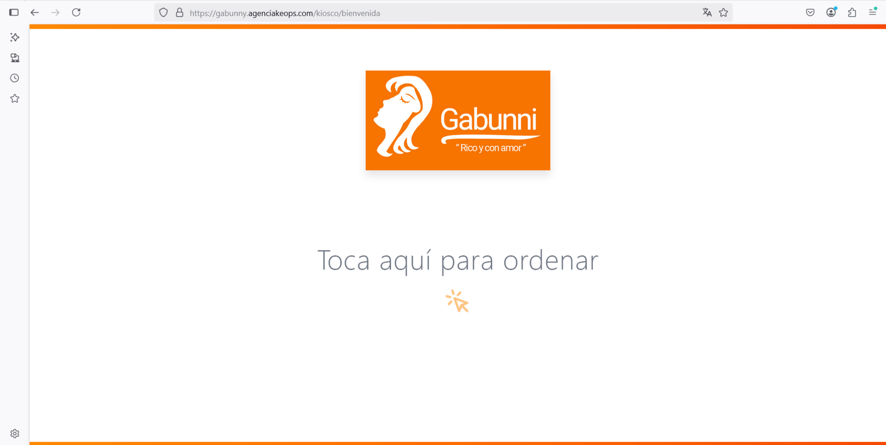
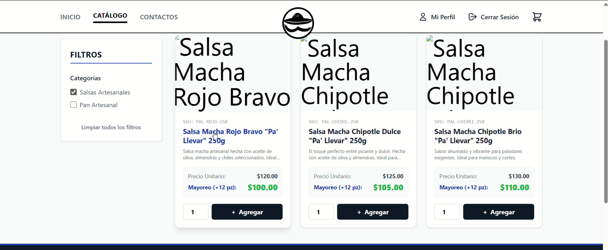

<h1 align="center">Hola, Yo soy Kevin Ramirez Mendez</h1>
### Desarrollador de Software | Web Full Stack & Entornos Virtuales (XR)

Soy un ingeniero apasionado por la creación de soluciones tecnológicas, con experiencia abarcando desde arquitecturas web hasta el desarrollo de experiencias interactivas e inmersivas. 

Me gusta abordar los retos técnicos con un enfoque lógico y estructurado, ya sea desarrollando Aplicaciones Web Progresivas (PWA) y ecosistemas ecommerce, o programando mecánicas y simulaciones físicas para videojuegos y aplicaciones de Realidad Virtual y Aumentada (AR/VR).

🚀 **Mi enfoque:** Escribir código limpio, resolver problemas complejos y fusionar la lógica de backend con interfaces (y entornos) centrados en el usuario.

<h3 align="left">Contactame:</h3>

* **Correo:** kevito321.krm@gmail.com
* **Teléfono:** (+52) 241 419 48 49
* **Currículum:** [📄 <a href="https://drive.google.com/file/d/18ZncNjM2g721jVEQHwdMJ5NTI5o-sfp6/view?usp=sharing">Ver mi CV especializado en Web</a>]
<h5>Redes Sociales</h5>

### 🛠️ Herramientas y Lenguajes

**Frontend & UI**  

**Backend**  

**Base de Datos & DevOps**  

**Desarrollo de Videojuegos y XR**  

## 🚀 Áreas de Especialización

### 🕶️ Realidad Aumentada, Virtual y Desarrollo de Videojuegos
* **Desarrollo XR (AR/VR):** Creación de experiencias inmersivas, incluyendo aplicaciones de Realidad Aumentada y entornos de Realidad Virtual.
* **Desarrollo de Videojuegos:** Diseño y programación de mecánicas para juegos 2D y 3D (Unity/C#).
* **Arte Técnico (Technical Art):** Pipeline completo de creación de assets 3D: desde el modelado hasta la animación avanzada e integración en motores de juego.

### 💻 Desarrollo Web Moderno
* **Aplicaciones Web Progresivas (PWA):** Desarrollo de soluciones complejas como sistemas de *delivery* (gestión de pedidos, carrito de compras y seguimiento en tiempo real).
* **Desarrollo Frontend & UI:** Diseño de interfaces atractivas con enfoque en la experiencia de usuario (UX).

---

## 📂 Proyectos Destacados

### 1. Gabunni | Sistema Integral de Gestión (PWA, POS y Kiosco Digital)

🥬 **App Web Progresiva (PWA):** Plataforma completa para venta de alimentos con arquitectura de microservicios, optimizada para la gestión de pedidos en tiempo real.

* **Destacado:** Desarrollo del ciclo de vida completo. Expansión de la PWA inicial integrando un módulo de Punto de Venta (POS) y un Kiosco Digital interactivo optimizado para tablets. Implementación de algoritmos de upselling dinámico y pagos seguros con código QR y tarjeta.
* **Reto:** Sincronización en tiempo real de estados de pedidos entre el cliente, el Kitchen Display System (KDS) y el panel administrativo, además de contenerizar la aplicación para su despliegue.
* **Tech Stack:** `Vite + React` `Django Rest` `PostgreSQL` `Redis` `WebSockets` `Tailwind` `Docker` `Git` `Mercado Pago API`
* **Enlaces:** [▶️ <a href="https://drive.google.com/drive/folders/1sm5zrxI0hPViECowNYU4Yq2DoxQtJ4JO?usp=drive_link">Ver Demo en Video</a>]

 

### 2. Plataforma B2B Mayorista

📦 **E-commerce:** Plataforma web orientada a ventas al por mayor con lógica de precios dinámicos.

* **Destacado:** Diseño y creación desde cero de una arquitectura robusta para la gestión de ventas empresariales. Implementación de un motor de reglas de negocio para aplicar precios escalonados basados en el volumen de piezas compradas.
* **Reto:** Preparación de la lógica de inventarios y conexión exitosa del flujo de pago con pasarelas externas.
* **Tech Stack:** `PHP` `Laravel` `React.js` `MySQL` `Mercado Pago API`
* **Enlaces:** [▶️ <a href="https://drive.google.com/drive/folders/1Gefthyl1DQceG7B5LwMZFQGjCu24xkKc?usp=drive_link">Ver Demo en Video</a>]

 

### 3. Feria Geek App
> 📖 **Narrativa Inmersiva:** Aplicación móvil a peticion de la Colmena, Centro de Tecnologías Creativas Grace Quintanilla, para la Feria Geek con el objetivo de enriquecer la experiencia de los visitante

* **Reto:** Optimizar modelos 3D para móviles, animacion avanzada que concordara con los dialogos.
* **Tech Stack:** `Unity` `Vuforia` `C#` `Blender`
* **Enlaces:**  [▶️ Apk](https://drive.google.com/file/d/16ptNlUZJ-sCoVsej073Mj3vXnAy7lviD/view)

 

### 4. VirtualBody
> 🎮 **Experiencia de Juego VR:** Videojuego en realidad virtual desarrollado desde cero, en la cual tiene como objetivo aprender sobre los organos del cuerpo humano.

* **Destacado:** 2 modos de juegos: el primero el jugador es libre de interactuar con los organos y aprender con ChibiAI(asistente del juego) y el segundo Modo Vs Dr.IA donde compite por encontrar y armar el cuerpo antes de Dr.IA(Robot enemigo).
* **Tech Stack:** `Unity 3D` `Blender` `C#` `XR toolkits`
* **Enlaces:** [▶️ Ver Gameplay V.1](https://drive.google.com/file/d/1Xq8SUpXR2Pe0uq5MigJ-BpolKyHRxPfQ/view?usp=drive_link)

---

  <i>¿Quieres ver más? Revisa <a href="URL_A_TU_PESTAÑA_REPOSITORIOS">todos mis repositorios</a>.</i>

